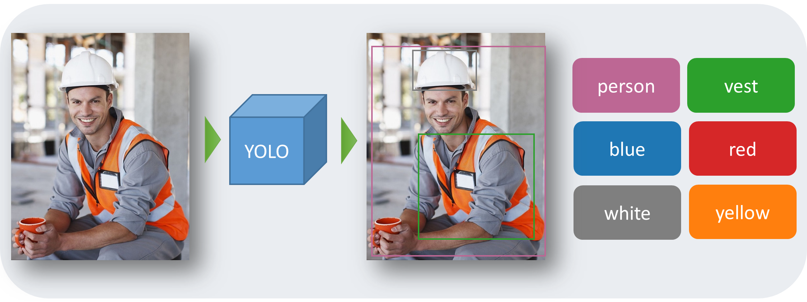
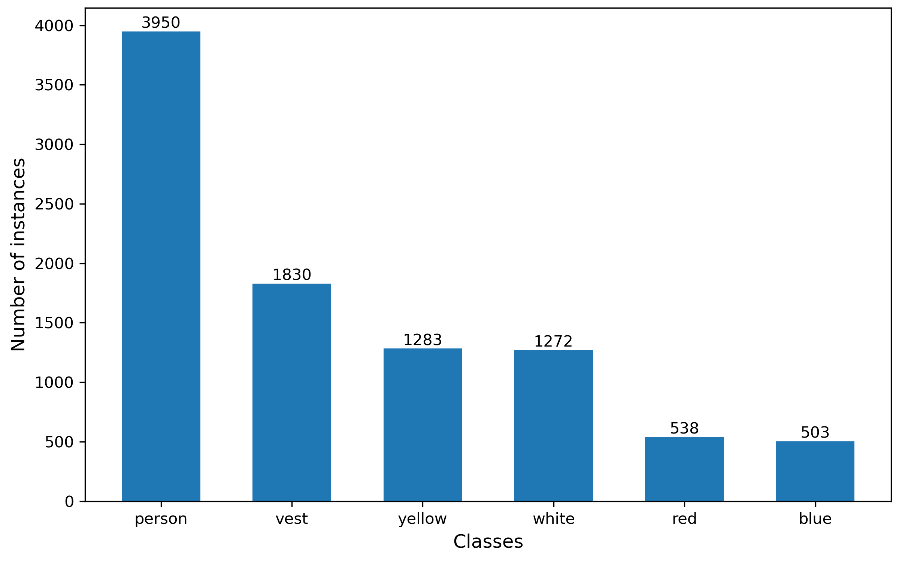
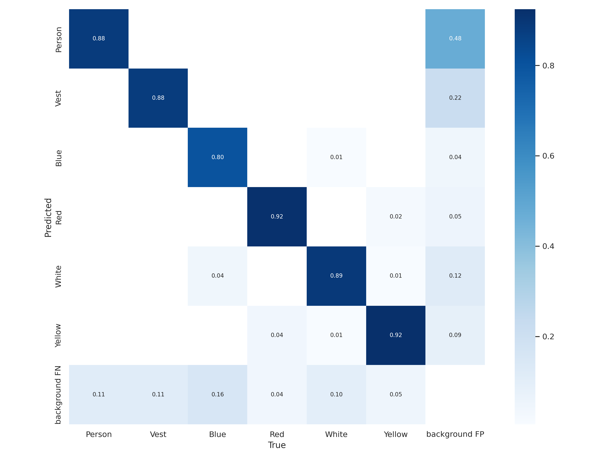
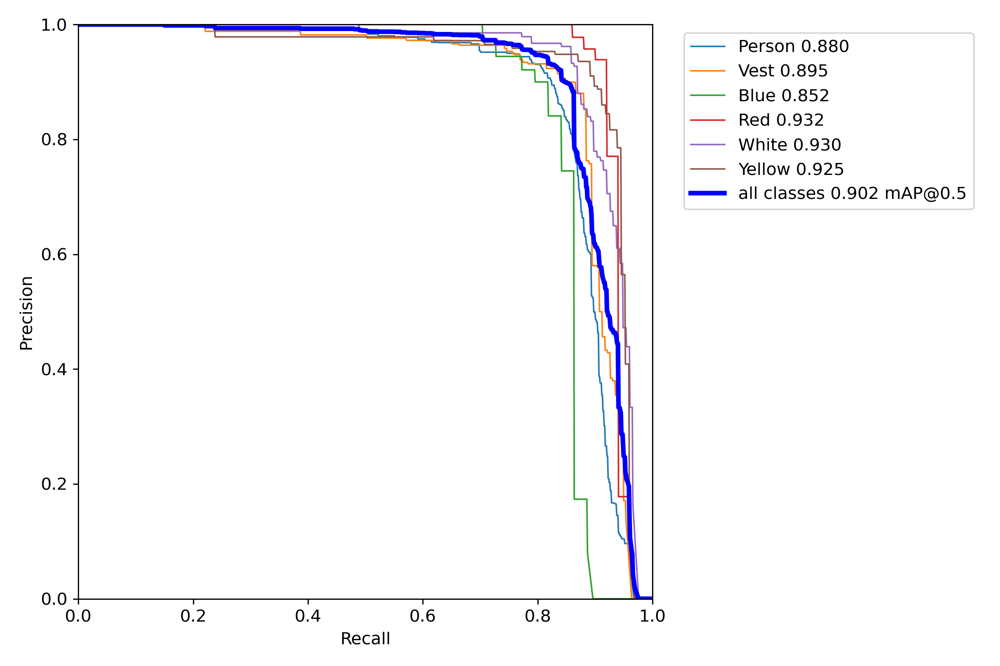

# Real-time PPE Detection & Open Dataset Using Yolov7 ([Open Access paper link](https://www.mdpi.com/1424-8220/21/10/3478))

## Introduction

The repository introduces eight DL models built on You Look Only Once (YOLO) architecture for PPE detection. Meanwhile, a novel high-quality dataset is constructed for detecting the person, the vest, and four helmet colors.

## Framework

## CHV Dataset

A novel dataset  is constructed for detecting the helmet, the helmet colors and the person for this project, named **Color Helmet and Vest (CHV)** dataset. 

Instead of just accepting exiting images, strict criteria are designed at the beginning, and only  1,330 high-quality images among 10,000 ones from the Internet and open datasets are selected. 

The dataset is open for free use, please download at [Google Drive](https://drive.google.com/file/d/1fdGn67W0B7ShpBDbbQpUF0ScPQa4DR0a/view?usp=sharing) or [Baidu Yunpan (password: f003)](https://pan.baidu.com/s/1G9EbLKUgF1tcOPCeWSEeMw ). 

The weight can be download here: [Google Drive](https://drive.google.com/file/d/1TyVWasHdNGGHy88pbI26nbawS2jA2Syc/view?usp=sharing)

If the dataset helpes you, please cite the repository in your article:
	
`Wang, Z.; Wu, Y.; Yang, L.; Thirunavukarasu, A.; Evison, C.; Zhao, Y. Fast Personal Protective Equipment Detection for Real Construction Sites Using Deep Learning Approaches. Sensors 2021, 21, 3478. https://doi.org/10.3390/s21103478`

## Results

- **YOLO V7 owns the best mAP, 90.2%.**

 

Figure: Mean average precision.

## 
